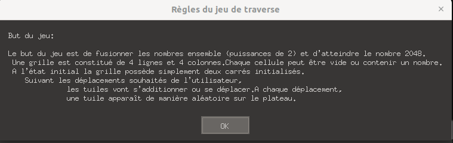
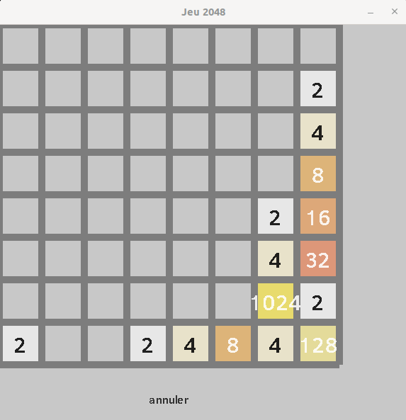
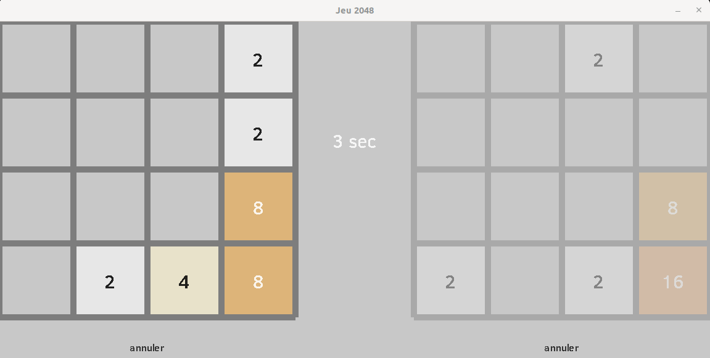

# Projet Final 2048

Ce dépôt contient le jeu 2048, un jeu de puzzle où vous combinez des tuiles numérotées pour atteindre le chiffre 2048. Il est jouable en solo ou en multijoueur avec diverses options de jeu.

## Prérequis

### Installer GCC

#### Sous Linux
GCC peut être installé via le gestionnaire de paquets. Ouvrez un terminal et exécutez :
```bash
sudo apt-get update
sudo apt-get install gcc
```

#### Sous Windows
Pour installer GCC sous Windows, vous pouvez utiliser MinGW. Suivez ces étapes :
1. Téléchargez MinGW depuis [le site officiel](http://mingw.org/).
2. Installez MinGW et lors de l'installation, assurez-vous de sélectionner `mingw32-base-bin` et `mingw32-gcc-g++-bin`.
3. Ajoutez le chemin du répertoire `bin` de MinGW à la variable d'environnement PATH.

### Installer les bibliothèques SDL2

#### Sous Linux
Exécutez les commandes suivantes pour installer SDL2 et ses extensions :
```bash
sudo apt-get install libsdl2-dev libsdl2-image-dev libsdl2-ttf-dev
```

#### Sous Windows
Installez les bibliothèques SDL2 en téléchargeant les fichiers de développement depuis les sites officiels et en configurant les chemins dans votre IDE ou environnement de développement.

## Compilation

Pour compiler le jeu, ouvrez un terminal ou une invite de commande dans le dossier du projet et tapez :
```bash
make all
```

## Utilisation

Lancez le jeu avec l'exécutable généré (`./2048` sous Linux ou double-cliquez sur `2048.exe` sous Windows). Au lancement, sélectionnez le mode de jeu désiré.


## Avec Docker

#### Prérequis

Installer Docker :
- Linux : Suivre les instructions sur [docker.com](https://docs.docker.com/engine/install/).

#### Construire l'image Docker

Dans le répertoire du projet, exécutez :
```bash
docker build -t mon2048 .
```

#### Exécuter le conteneur Docker

Autoriser l'accès à X11 :
```bash
xhost +local:docker
```

Lancer le conteneur :
```bash
docker run -it --rm -e DISPLAY=$DISPLAY -v /tmp/.X11-unix:/tmp/.X11-unix --device /dev/dri:/dev/dri mon2048
```

Révoquer l'accès X11 après utilisation :
```bash
xhost -local:docker
``` 


### Modes de jeu

| Mode         | Description                                          | Multi-joueur | Notes                      |
|--------------|------------------------------------------------------|--------------|----------------------------|
| Libre        | Continuez jusqu'à ce qu'il n'y ait plus de mouvements| Oui          | Disponible en solo et duo  |
| Temps limité | Atteignez le meilleur score dans le temps imparti    | Oui          | Disponible en solo et duo  |

En mode solo, les joueurs ont le choix entre deux tailles de grille :
- **4x4** : La taille standard pour une partie rapide et stratégique.
- **8x8** : Une taille plus grande pour une partie plus complexe et de plus longue durée.

### Mode avec l'Ordinateur
En plus du mode solo classique, les joueurs peuvent choisir de jouer contre l'ordinateur.   

### Commandes

- **Joueur 1** : Utilisez les touches directionnelles du clavier.
- **Joueur 2** (si applicable) : Utilisez `Z`, `Q`, `S`, `D` pour les déplacements.


## Rendu Visuel





